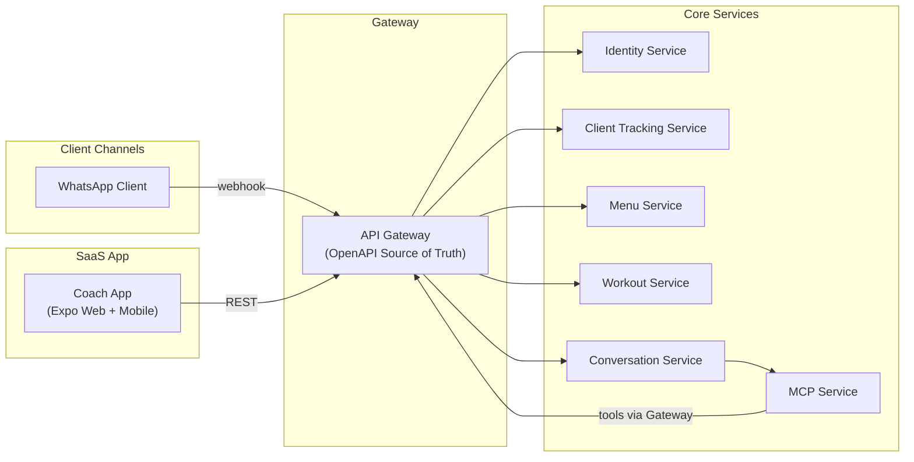

# Nutri-Voice — Smart Coach SaaS (Web • Mobile • WhatsApp)

Nutri-Voice is a **Smart Coach SaaS** platform that helps fitness & nutrition coaches deliver highly-personalized guidance at scale—without losing the human touch.

It combines three pillars:

1. **Coach App (Expo — Web + Mobile)**  
   A coach “control plane” for managing clients, nutrition/workout plans, tracking, analytics, and an AI-assisted inbox.

2. **Client Chat Bot (WhatsApp)**  
   A client-facing chat channel for fast, natural logging (meals, workouts, weight, daily state) and Q&A—built to feel like texting your coach.

3. **AI Orchestration (MCP)**  
   An MCP runtime that retrieves **verified domain context** (plans, logs, targets, trends) before making decisions—enabling safe auto-replies and **human-in-the-loop escalation** to the coach when needed.

---

## Table of Contents
- [What You Can Do](#what-you-can-do)
- [How It Works](#how-it-works)
- [Architecture](#architecture)
- [Tech Stack](#tech-stack)
- [Repository Structure](#repository-structure)
- [Documentation](#documentation)
- [Safety & Guardrails](#safety--guardrails)
- [Roadmap](#roadmap)

---

## What You Can Do

### For Coaches
- **Client dashboard** with high-signal summaries (recent logs, adherence, trends)
- **Inbox & conversation history** with AI-assisted suggested replies and summaries
- **Nutrition planning** (template → client customization)
- **Workout planning** (templates, programs, exercises)
- **Tracking & analytics** (daily state, meal/workout/weight logs, metrics)

### For Clients (WhatsApp Bot)
- Log **meals**, **workouts**, **weights**, and **daily status** in seconds
- Get fast answers and reminders based on the coach’s plan and targets
- Escalate to the coach seamlessly when the request needs human judgment

---

## How It Works

1. A client sends a WhatsApp message (log, question, update).
2. Webhook ingress normalizes and stores the event.
3. The **Conversation Service** triggers the **MCP Service** with the message + conversation context.
4. MCP retrieves trusted context from domain services (via the Gateway), then the LLM decides:
   - **AUTO_REPLY** (safe, low-risk, and supported by verified context), or
   - **ESCALATE_TO_COACH** (creates an inbox item + suggested reply for approval)

The result: **personalized, contextual coaching** with minimal coach overhead—and a clear path to human oversight.

---

## Architecture



### Architectural Principles
- **Gateway-backed microservices** (clean boundaries + single entry point)
- **Contract-first API**: Gateway publishes OpenAPI → SDK is generated (Orval)
- **Webhook ingress** for messaging channels (WhatsApp) with normalization + routing
- **MCP-driven AI**: tool-based context retrieval and controlled side-effects
- **Human-in-the-loop** where uncertainty or risk is high

---

## Tech Stack

### Frontend (Coach App)
- Expo (Web + Mobile) + Expo Router
- TanStack Query for caching and background refresh
- Orval-generated typed SDK for contract alignment

### Backend (Services)
- Node.js microservices (REST)
- API Gateway with JWT-based user auth and internal-token service auth
- Domain services: Identity, Tracking, Menu, Workout, Conversation
- MCP service for AI orchestration

### AI Layer (MCP)
- Tool-based context retrieval (plans, logs, targets, trends)
- Decisioning: auto-reply vs. escalation, plus suggested replies for coach approval

---

## Repository Structure

```
.
├── apps/
│   ├── Saas-app/                 # Expo Coach App (Web + Mobile)
│   └── common/                   # Shared Orval SDK + API utilities
├── services/
│   ├── gateway-service/          # Single entry point + OpenAPI source of truth
│   ├── idm-service/              # Identity, auth, subscriptions (MFA-ready)
│   ├── client-tracking-service/  # Daily state + logs + metrics
│   ├── menu-service/             # Nutrition planning + food/vitamins
│   ├── workout-service/          # Exercises + programs
│   ├── conversation-service/     # Conversations, inbox, channel ingress
│   └── mcp-service/              # MCP runtime (AI orchestration)
└── orval.config.js               # SDK generation config
```

---

## Documentation
- Backend services deep dive: **`services/README.md`**
- Coach app deep dive: **`apps/Saas-app/README.md`**

---

## Safety & Guardrails
Nutri-Voice is built for **reliable coaching**, not “random chatbot advice.” Key guardrails include:
- **Verified context before generation** (MCP tools fetch source-of-truth data)
- **Controlled side-effects** (writes/logging actions happen through explicit tool calls)
- **Human escalation** for uncertainty, sensitive topics, or high-impact decisions
- **Audit-friendly**: conversations and logs remain structured and traceable

---

## Roadmap
- **Coach Personal Assistant (via MCP):** proactive insights, follow-ups, and planning support
- **More WhatsApp automation:** richer flows, templates, and media support
- **Deeper analytics:** adherence scoring, trend explanations, cohort dashboards
- **Coach workflow tools:** saved macros, tone profiles, escalation rules
- **Production hardening:** observability, rate limiting, and multi-tenant billing integrations

---

> If you’re reviewing this project for an interview: the core differentiator is the **MCP-driven, context-first AI** plus a **contract-first platform** that keeps frontend and backend aligned while scaling across multiple services.
