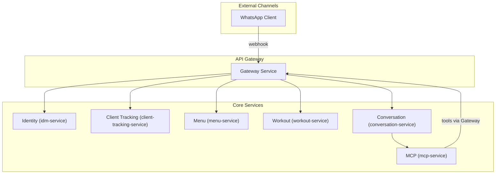

# Services Overview (Backend)

This directory contains the backend services powering Nutri-Voice. The architecture is **gateway-backed microservices** with **webhook ingress** for external messaging channels (WhatsApp) and strict separation between **user auth** (JWT) and **service-to-service auth** (internal token).

---

## Table of Contents
- [Service Map](#service-map)
- [Gateway Service](#gateway-service-gateway-service)
- [Conversation Service](#conversation-service-conversation-service)
- [MCP Service](#mcp-service-mcp-service)
- [Tracking Service](#client-tracking-service-client-tracking-service)
- [Menu Service](#menu-service-menu-service)
- [Workout Service](#workout-service-workout-service)
- [Identity Service](#identity-service-idm-service)
- [Security Model](#security-model)
- [Operational Notes](#operational-notes)

---

## Service Map

---

## Gateway Service (`gateway-service`)
**Responsibility:** single entry point, auth enforcement, request forwarding, and **OpenAPI source of truth**.

**Highlights:**
- Serves `/api/docs` + `/api/docs-json` for Swagger/OpenAPI.
- Enforces:
  - **Internal token** for trusted internal calls
  - **JWT validation** for user-facing calls
- Routes requests to domain services (menu, workout, tracking, identity, conversation).
- Hosts webhook ingress endpoints used by external messaging channels (WhatsApp).

---

## Conversation Service (`conversation-service`)
**Responsibility:** messaging orchestration and conversation state for coach ↔ client communication.

**Typical responsibilities:**
- Stores conversation threads and messages
- Maintains an **inbox** for items requiring coach attention
- Triggers the MCP runtime to decide auto-reply vs. escalation
- Provides coach-facing APIs for reading threads, sending replies, and marking items handled

---

## MCP Service (`mcp-service`)
**Responsibility:** the **Model Context Protocol (MCP)** runtime for AI behavior.

**How MCP works here:**
1. Conversation service calls MCP with a new inbound message and metadata.
2. MCP invokes an LLM **with tools enabled**.
3. Tools fetch verified context through the Gateway:
   - daily state, logs, and trends
   - active nutrition plan and targets
   - workout program context
   - conversation history and inbox state
4. MCP returns a decision:
   - **AUTO_REPLY**: safe response generated using verified context
   - **ESCALATE_TO_COACH**: produce a suggested reply + create an inbox item

This structure ensures the AI is grounded and keeps human control where appropriate.

---

## Client Tracking Service (`client-tracking-service`)
**Responsibility:** time-series tracking and daily status for client behavior.

**Examples of domain data:**
- daily state (sleep/energy/compliance)
- day type selection (training/rest)
- logs: meals, workouts, weights, metrics

---

## Menu Service (`menu-service`)
**Responsibility:** nutrition planning + food catalog.

**Examples of domain data:**
- template menus, meals, options, and items
- vitamins & supplements
- client menu cloning and customization

---

## Workout Service (`workout-service`)
**Responsibility:** exercise catalog and program planning.

**Examples of domain data:**
- exercises (incl. media/video URLs)
- workout templates
- workout programs with day structure

---

## Identity Service (`idm-service`)
**Responsibility:** authentication, user profiles, and subscription model (MFA-ready).

**Examples of domain data:**
- login/refresh flows
- MFA endpoints (when enabled)
- user profile & role data
- subscription state

---

## Security Model
- **External / user-facing traffic** is authenticated via **JWT** at the gateway.
- **Internal service-to-service traffic** uses an **internal token**.
- Domain services assume the gateway has enforced auth and rely on internal-token trust.
- Role-based access is applied consistently (coach vs. client) at the gateway boundary.

---

## Operational Notes
- The gateway is the system’s **public contract boundary** and the **only** place the frontend depends on.
- The MCP service is deliberately separated so AI behavior can evolve independently of core domain logic.
- Webhook ingress is normalized and routed through the same gateway to ensure consistent auth, logging, and validation.

> For UI integration details and typed SDK usage, see `apps/Saas-app/README.md`.
